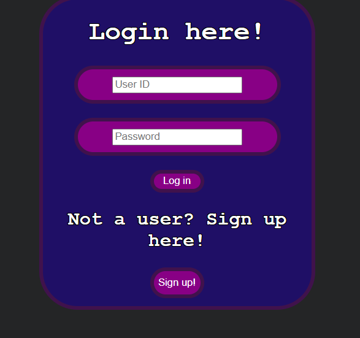
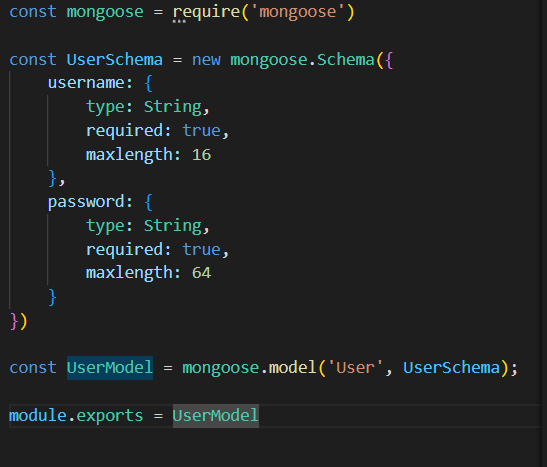
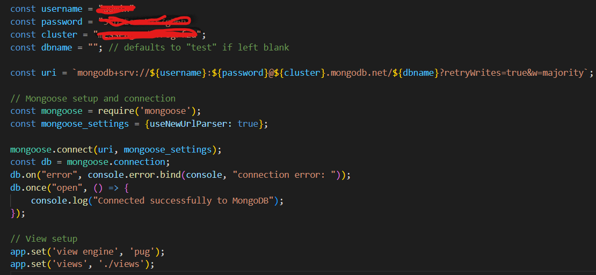
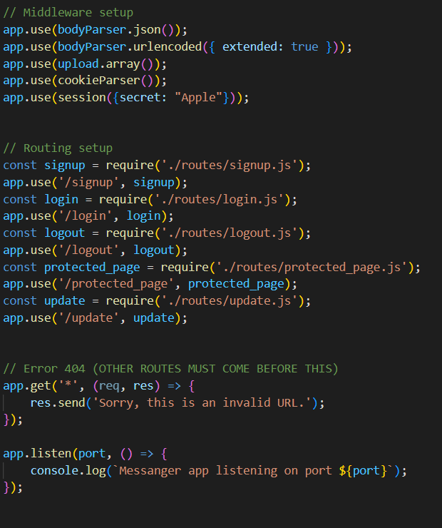
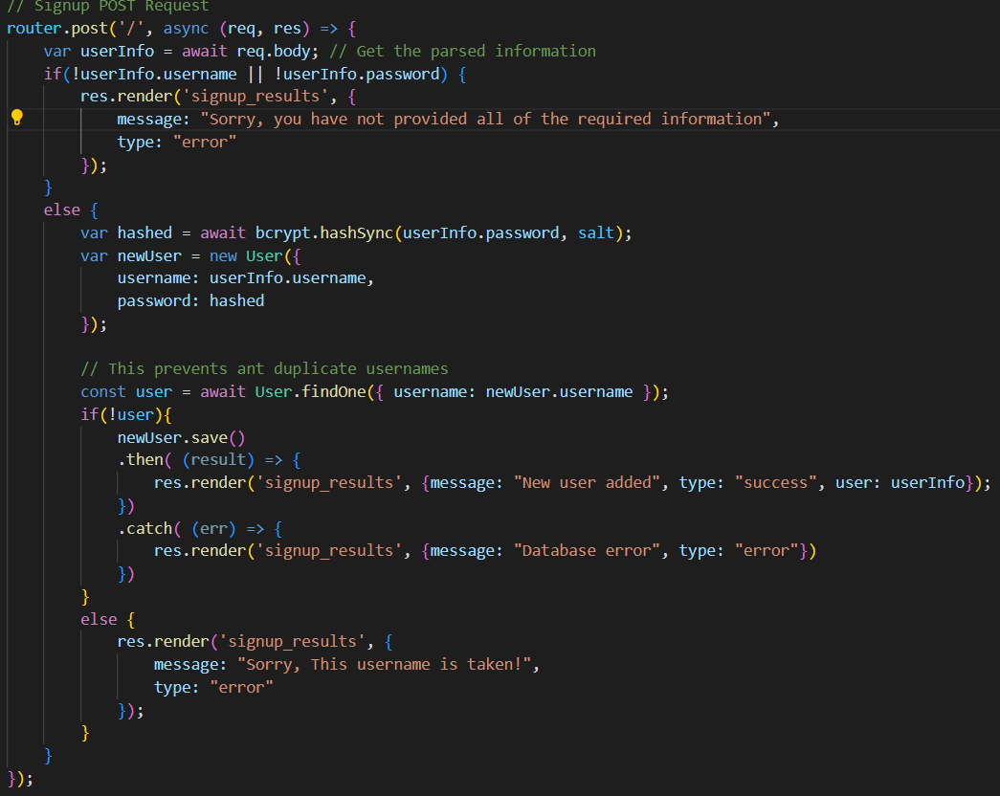
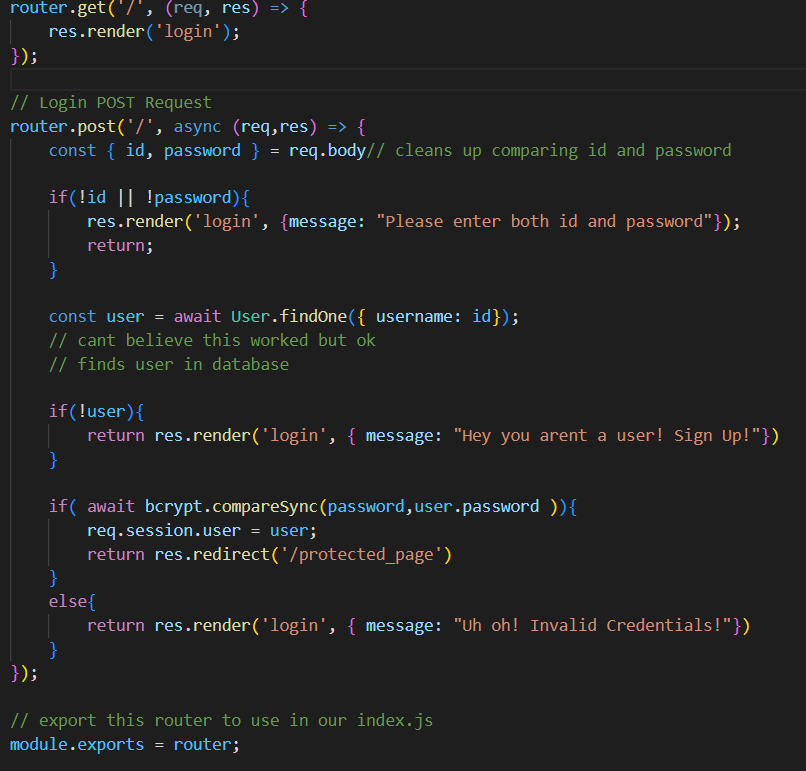
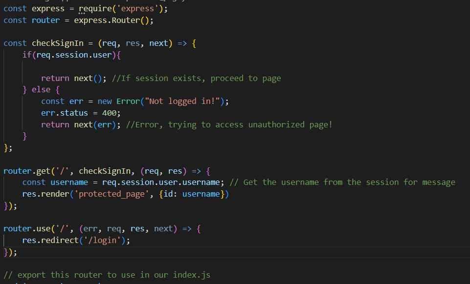
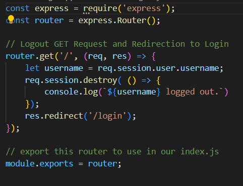
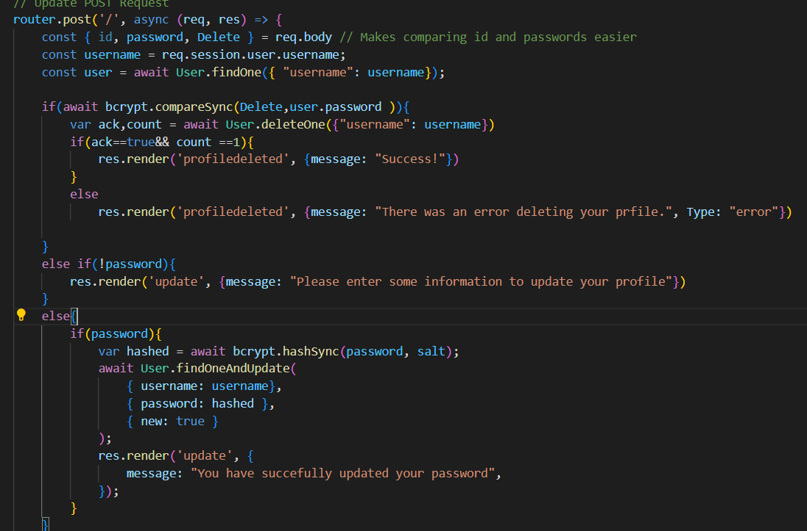

# cps490-23f-team7
*Description*: Team 7's Fall 2023 CPS 490  - Group Repository

## About

University of Dayton

Department of Computer Science

CPS 490 -- Capstone I -- Fall 2023

Instructor: Dr. Nick Stiffler

## Table of Contents
- [Team Members](#team-members)
- [Project Management Information](#project-management-information)
- [Revision History](#revision-history)
- [Overview](#overview)
- [System Analysis](#system-analysis)
- [System Design](#system-design)
- [Implementation](#implementation)
- [Software Process Managment](#software-process-management)
- [User Guide/Demo](#user-guidedemo)
- [Use Cases](UseCases.md)

# Case Study: Messenger Application

## Team Members

1. Jonathan Pieroni | pieronij2@udayton.edu
2. Daniel Lambert   | lambertd4@udayton.edu
3. Joseph Johnson   | johnsonj73@udayton.edu
4. Aaron McClellan  | mcclellana4@udayton.edu

## Project Management Information

Heroku Permalink: <https://team07-messenger-app-58c08de05cae.herokuapp.com/>

Management board: <https://trello.com/b/txjCjXfN/capstone-1-project>

Source code repository: <https://github.com/lambertd4/Capstone1>

## Revision History

| Date     |   Version     |  Description    |
|----------|:-------------:|----------------:|
|09/12/2023|  0.01         | Initial draft   |
|10/25/2023|  0.10		   | User registration has been added|
|10/29/2023|  0.20		   | Login/Logout/Protected page added|
|10/30/2023|  0.30		   | Update/Delete/Salt&Hash/CSS added|
|11/15/2023|  0.40		   | General Chat Running|
|11/19/2023|  0.30		   | Can Create Private Chats|
|11/26/2023|  0.30		   | Provate Chats fully Operational|

## Overview

We are at the end of our first sprint, adding many new features to our app! We made it so that we have users who can register for an account, login to their profile to access their own protected page, and edit their profile! Our main focus for this sprint was setting up our user database and giving user's some options for their profile. Users will be able to change their password and delete their account if they want to. In addition to this we made it so passwords were salted and hashed instead of stored plainly in our database. Also we worked on our route structure, making it much more clean and easy to tell which routes lead where. We also wanted to begin to think of design ideas for the future of our webapp! We agreed upon a color palate that we plan on implementing into all future pages via css routes. 

## System Analysis

### User Requirements

List user requirements of the project that the team will develop into use cases in later steps.

- A user can register for access 
- A user can login 
- A user can logout
- A logged in user can send a message
- A logged in user can recieve a message
- An unregistered user cannot send or recieve messages

### Use Cases
[Use Cases](UseCases.md)

## System Design

In this section we are going to go over a few important ways about how we put our app together!

### Use-Case Realization

Use cases are very important for realizing our goals for developing our app! We should do them first so that it is clear what we are doing on a page and how we are doing it! See [Use Cases](UseCases.md)

### Database 

We set up our database using mongoose and mongodb! This allowed us to make a database of users, and we will further expand it's uses in future sprints! In order to access our database from our computers we had to creteat a authentification step in our code that let us access the data from it, and we make sure that the first thing that is done when our server launches is to connect to our database! See [Database Connection!](#database-connection)

### User Interface

Much of our User Interface is handled via routes and CSS. We will show many snippits of our route further below, however CSS is most important for putting our page together in a way that our user can use our app efficiently! We created a css stylesheet for each page we used in app, and worked hard to make sure our features were obvious and easy on the eyes. We chose a cool color palate too! In the future to improve our user interface we want to add a home page that is accesable by all, but includes key links to places on our site like login, signup, and more!

    

## Implementation

In this section we will be highlighting key components of our implementation of our main features!

### User Model

In the code snippit below you can see how we made our user model. Our username is stored in a 16 bit string and our password a 64 bit string. We had to make our password a 64 bit string in order to implement salting and hashing, which will be shown later.

    

### Database Connection

In the snippet below we can see our mongoose database connection made at the top of our index.js file. We did this so we could insure that we connected to the database before accessing any routes. We have our credentails for database connection blurred, but by filling in the correct link we can modify our database!

    

### Routing

In this example we can see how our routin is handled after database connection! We made a folder for each route of our page, but by using index we have made highway to all of them in one page, which allows us to use run our server using just index for multiple routes on one clean page. 

    

### User Registration

In this code snippit we show how we allowed users to signup! As you can see we prevent a user from entering a blank name or password first, then it searches for a user with the same name as the one entered in our form. This prevents multiple usernames! We then save our new user as an actual user model and put them in our database! Our user is now free to use our app!

    

### Login

Below we have our login route! As you can see we prevent an empty username or password. Then we find the corresponding user and check to see if the input password matches the one found in our database! You may notice a comment that expresses Joe's amazement at the function working. This is because during our attempts to search for a user we realized that we would need the await function! The await function basically waits for the command we are working on to finish, prioritizing it.  

    

### Protected Page

Our protected page route is shown below! This page is where you are sent upon logging in! We first check the user session to make sure that our user is signed in with an authenticated account, then they have access to our their page! We also pass the user's name off to our pug to display a personalized message!

    

### Logout

Our logout function is shown below! Upon clicking the logout button our post request will be sent, which will destroy the user's current session! This puts them at square one, and they will be unable to access their page again untill they login!

    

### Updating your profile

Below we show off two whole features! First we show you how we handle deleting a profile. First we want to make sure our user has input their actual password. We wouldn't want someone else just hitting a button to delete their profile! Once that is done we search for our user and delete them from our database! Then, for our update password feature,

    

### Private Messaging

Our Private Messaging is shown below! This page is where you can send provate drect messages to other users! You may only send messages to a user that is signed in with an authenticated account, and has access to our protected pages!

[comment]: <> (This is a placeholder image)

    

### General Messaging

Our General Messaging is shown below! This page is where you can send group or general messages to other users all at once! Only a user that is signed in with an authenticated accountcan send messages!

[comment]: <> (This is a placeholder image)

    

## Deployment

We have deployed our application using Heroku. To do this you must link a repository with Heroku. To link the repositroy you must create a Heroku aplication and select deployement. After you tell your Heroku application that you want to deploy a github repository you simply need to link the two by signing into github and selecting which repository. Then you must select a branch to deploy from. This is likely going to be your master branch which in our case is called "main". This branch holds the most recent version of the application with completely working parts. With Heroku connected when you try to run the application you will get an error. That is becasue Heroku doesnt know where to run the application from. To fix this issue you simply need to create a file with imformation for Heroku. This file "package.json" tells Heroku we launch our application through index.js. By pushing this to the main branch Heroku will update and deploy our application.

Heroku Permalink: <https://team07-messenger-app-58c08de05cae.herokuapp.com/>

[comment]: <> (This is a placeholder image)

## Scrum Process

### Scrum Meetings

**Sprint 0**
1. Meeting on 9/19/23
	Discussed who Researched and who did work on read me.
	- Danny- Use Case Diagram and README
	- Joe- Angular and React
	- Aaron- Socket and View
	- Jon- Trello Board and some README

**Sprint 1**
1. Meeting on 10/24/23
	Discussed who developes each use case. Worked out work distribution for this phase.
	- Danny- Use Case Diagrams/Descriptions and Data Flow Diagrams
	- Joe- Login
	- Aaron- Registration
	- Jon- Registration

**Sprint 2**
1. Meeting on 11/07/23
	Discussed who developes what. 
	- Danny- Documentation/Diagrams/ReadMe
	- Joe- Messaging
	- Aaron- Messaging
	- Jon- Quality Of Life Updates

## Software Process Management

### Sprint 0

Duration: 09/18/2023 - 09/21/2023

Trello for Sprint 0.

Commits for Sprint 0.
    

#### Sprint 0 Completed Tasks

1. Research angular.js and react.js for viable technologies
2. Research socket.io and vue.js for viable technologies
3. Use case Diagram and use cases desciptions created.
4. Modify README.md to fulfil requirements for Team assignment 1.

#### Sprint 0 Contributions:

1.  Jonathan Pieroni, x hours, contributed in xxx
2.  Daniel Lambert,   3 hours, contributed in Diagrams and Project Creation
3.  Joseph Johnson,   5 hours, contributed in reasearch of Angular and React, pushed changes to READ.ME
4.  Aaron McClellan,  6 hours, contributed in Socket.io and vue.js research, Modify README.md to meet assignment 1 requirments

### Sprint 1

Duration 10/18/2023 - 10/31/2023

Trello for Sprint 1.

Commits for Sprint 1.

### Sprint 1 Completed Tasks

1. Decide on color theme for application
2. A user can register for access (usename & password)
3. A user can login
4. A user can logout
5. A logged in user can access a restricted page of the application that requires authentication
6. A user that is not logged in is unable to access a retricted page of the application that requires authentication
7. Move all routing from index.js to routes folder and individual js files
8. A logged-in-user can update their information (password)
9. A logged-in-user can request account deletion
10. Salting and Hashing user passwords

#### Sprint 1 Contributions:

1.  Jonathan Pieroni, 6 hours, contributed in salting and hasshing password on User registration and User update, and User profile Deletion.
2.  Daniel Lambert,   8 hours, contributed in all diagrams for Sprint 1 / Much documentation on README.md and UseCases.md
3. Joseph Johnson, 18 hours, contributed in Javascript CSS and Pug for the following: Login, Logout, Protected Page. Assisted in CSS for all pages. Implementation, Overview, and minor edits accross the README file. Assisted in formating of presentation. 
4.  Aaron McClellan,  24 hours, contributed in User registration, User update, User delete, All routing, setup, CSS, scrum manager, branch manager, debugging, README.md, and the USER model

### Sprint 2

Duration 10/31/2023 - 11/27/2023

Trello for Sprint 2.

[comment]: <> (This is a placeholder image)

Commits for Sprint 2.

[comment]: <> (This is a placeholder image)

### Sprint 2 Completed Tasks

1. Created a Home Page
2. Added password strength requirements and password confirmation on signup
3. Created an Online/Offline System
4. Created a Direct Messaging System for authenticated users
5. Created a Group Messaging System for authenticated users
6. Created authentication barriers for messaging 
7. Moved account delete from the update page to its own protected page
8. Created a Global Messaging System for all authenticated users
9. Created a "User is typing" feature
10. Added more profile information to users

#### Sprint 2 Contributions:

1.  Jonathan Pieroni, x hours, contributed in x
2.  Daniel Lambert,   10 hours, contributed in all diagrams for Sprint 2 updated README.md and UseCases.md and made outline for presentation.
3. Joseph Johnson, x hours, contributed in x
4.  Aaron McClellan,  x hours, contributed in x

#### Sprint Retrospective

###### Sprint 0

| Good     |   Could have been better    |  How to improve?  |
|----------|:---------------------------:|------------------:|
| Once goals were evventually established we excelled at our goals | Initial Goal Orientation  |Establish specific goals between eachother more efficiently|
| Once we had an efficient way of comunicating we had great communication | Meeting planning | Establish a more routine time to meet with the team |
| Met in person at library and capstone room | Library room was very small, Capstone room is other side of campus for all members | Establish meeting place at appropriate sized library room or house |

###### Sprint 1

| Good     |   Could have been better    |  How to improve?  |
|----------|:---------------------------:|------------------:|
| Made several clear and specefic goals on our trello board | Communication on who should do what and in what order was lacking | Meeting more frequently to establish goals and focus on more specefic tasks |
| Used a discord for online meet ups and updates  | Distribution of workload could have been better| As early as possible, discuss the distribution of work and make sure everyone starts early to improve timing |

###### Sprint 2

| Good     |   Could have been better    |  How to improve?  |
|----------|:---------------------------:|------------------:|
| Very distinct goals for each member which allowed us to worl simultaneaously | Problems took very long to solve  | Asking the professor for help with problems and being more proactive about fixing issues |

## User Guide/Demo

[Sprint1Demo](DemoSprint1.mp4)